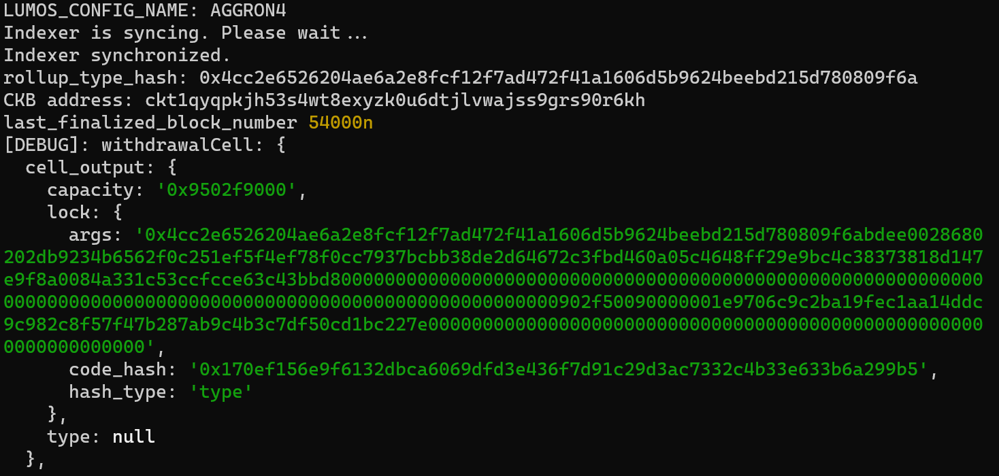
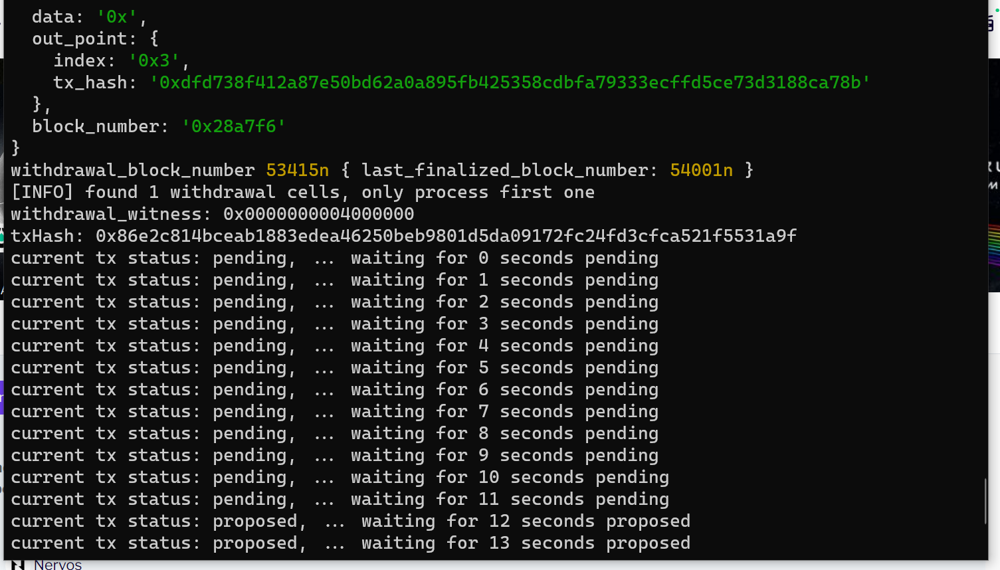
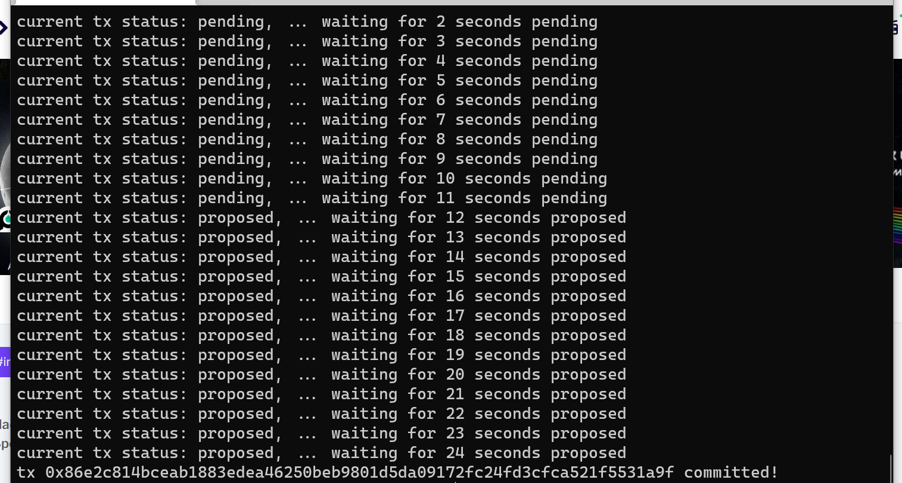

# Task 10:  Complete Withdrawal Process By Unlocking The Funds
https://gitcoin.co/issue/nervosnetwork/grants/11/

1) A screenshot of the console output immediately after running the "unlock" command.



2) The Ethereum address that you've used for your Layer 2 account (in text format).
```
0xA7F3f36Eb573D870aBf19A470eb0d878d395fe87
```
3) The Nervos Layer 1 address associated with the private key passed to "unlock" command (in text format). This is "ckb address" in the console output.
```
ckt1qyqpkjh53s4wt8exyzk0u6dtjlvwajss9grs90r6kh
```