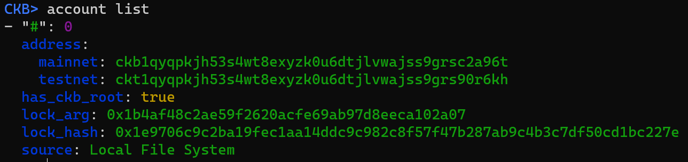
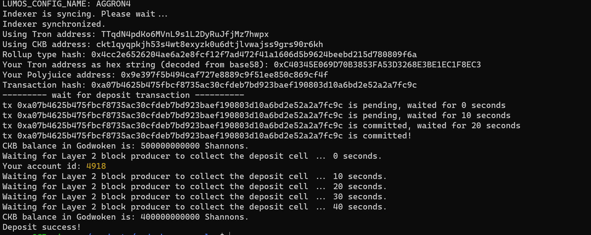
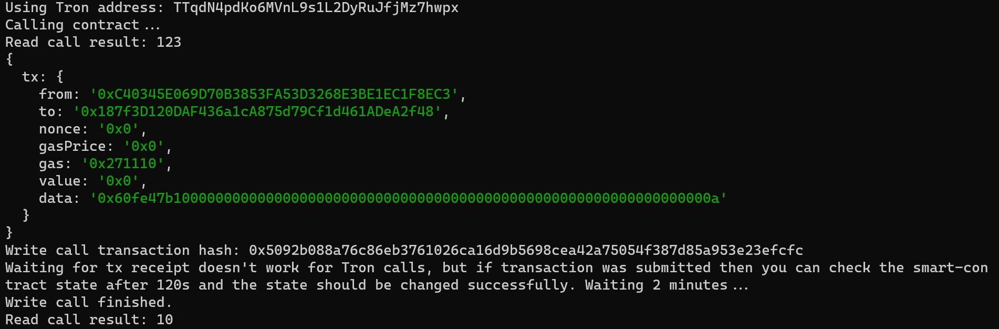

# Task 11:  Use A Tron Wallet To Execute A Smart Contract Call
https://gitcoin.co/issue/nervosnetwork/grants/15/

1) A screenshot of the accounts you created (account list) in ckb-cli.

2) A link to the Layer 1 address you funded on the Testnet Explorer.
https://explorer.nervos.org/aggron/address/ckt1qyqpkjh53s4wt8exyzk0u6dtjlvwajss9grs90r6kh
3) A screenshot of the console output immediately after you have successfully submitted a CKByte deposit to your Tron account on Layer 2.

4) A screenshot of the console output immediately after you have successfully issued a smart contract calls on Layer 2.


_____________________________________________

5) The transaction hash of the "Contract call" from the console output (in text format).
```
assd
```
6) The contract address that you called (in text format).
```
sta
```
7) The ABI for contract you made a call on (in text format).
```
[
    {
      "inputs": [],
      "stateMutability": "payable",
      "type": "constructor"
    },
    {
      "inputs": [
        {
          "internalType": "uint256",
          "name": "x",
          "type": "uint256"
        }
      ],
      "name": "set",
      "outputs": [],
      "stateMutability": "payable",
      "type": "function"
    },
    {
      "inputs": [],
      "name": "get",
      "outputs": [
        {
          "internalType": "uint256",
          "name": "",
          "type": "uint256"
        }
      ],
      "stateMutability": "view",
      "type": "function"
    }
  ]
  
```
8) Your Tron address (in text format).
```
TTqdN4pdKo6MVnL9s1L2DyRuJfjMz7hwpx
```
